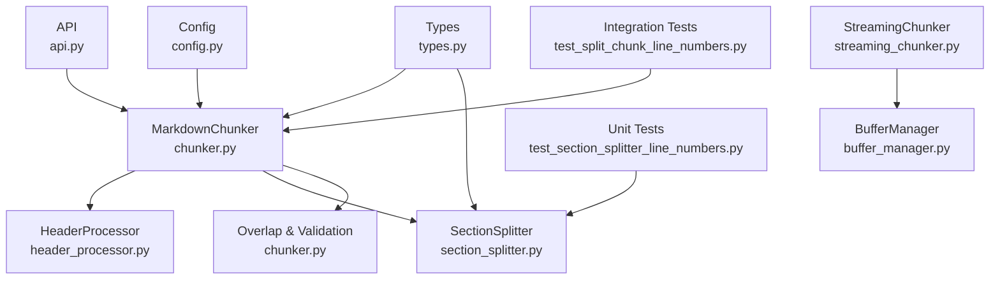
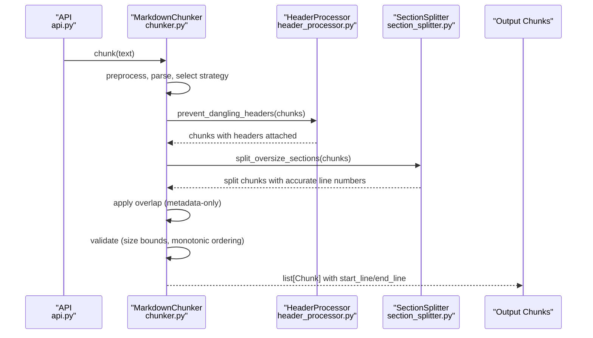
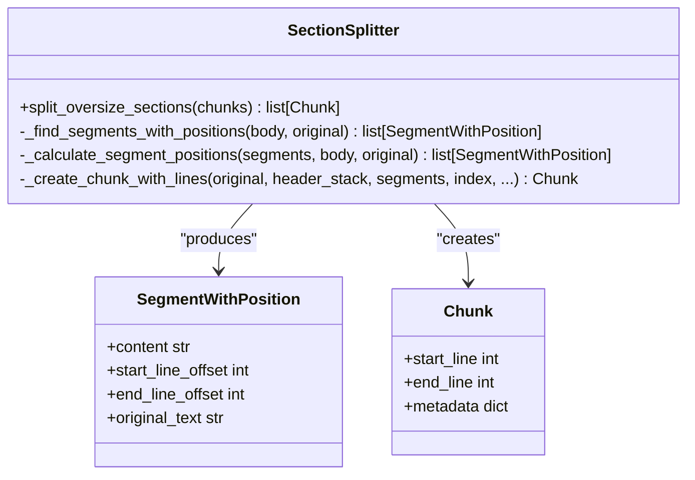
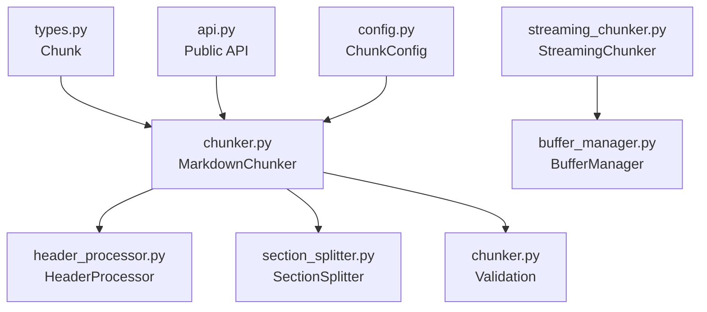

# Line Number Accuracy

<cite>
**Referenced Files in This Document**
- [chunker.py](file://src/chunkana/chunker.py)
- [section_splitter.py](file://src/chunkana/section_splitter.py)
- [header_processor.py](file://src/chunkana/header_processor.py)
- [types.py](file://src/chunkana/types.py)
- [streaming_chunker.py](file://src/chunkana/streaming/streaming_chunker.py)
- [buffer_manager.py](file://src/chunkana/streaming/buffer_manager.py)
- [config.py](file://src/chunkana/config.py)
- [api.py](file://src/chunkana/api.py)
- [test_split_chunk_line_numbers.py](file://tests/integration/test_split_chunk_line_numbers.py)
- [test_section_splitter_line_numbers.py](file://tests/unit/test_section_splitter_line_numbers.py)
- [test_line_numbers_performance.py](file://tests/performance/test_line_numbers_performance.py)
- [test_line_numbers_properties.py](file://tests/property/test_line_numbers_properties.py)
</cite>

## Table of Contents
1. [Introduction](#introduction)
2. [Project Structure](#project-structure)
3. [Core Components](#core-components)
4. [Architecture Overview](#architecture-overview)
5. [Detailed Component Analysis](#detailed-component-analysis)
6. [Dependency Analysis](#dependency-analysis)
7. [Performance Considerations](#performance-considerations)
8. [Troubleshooting Guide](#troubleshooting-guide)
9. [Conclusion](#conclusion)

## Introduction
This document explains how line numbers are calculated and preserved across chunk boundaries in the chunkana project. It focuses on the mechanisms that ensure:
- Split chunks have accurate, different, and monotonically increasing line numbers
- Non-split chunks retain their original line numbers
- Streaming processing preserves line coverage and ordering
- Validation and tests confirm correctness

The goal is to make line number semantics clear for both developers and users, and to provide practical guidance for diagnosing and maintaining accuracy.

## Project Structure
The line-number accuracy spans several modules:
- Pipeline orchestration and validation
- Section splitting with position-aware segmenting
- Header attachment to prevent dangling headers
- Streaming buffer windows and metadata propagation
- Public API and configuration

**Diagram sources**
- [chunker.py](file://src/chunkana/chunker.py#L87-L185)
- [header_processor.py](file://src/chunkana/header_processor.py#L416-L482)
- [section_splitter.py](file://src/chunkana/section_splitter.py#L70-L115)
- [streaming_chunker.py](file://src/chunkana/streaming/streaming_chunker.py#L43-L99)
- [buffer_manager.py](file://src/chunkana/streaming/buffer_manager.py#L29-L55)
- [api.py](file://src/chunkana/api.py#L18-L41)
- [types.py](file://src/chunkana/types.py#L240-L376)
- [config.py](file://src/chunkana/config.py#L17-L126)
- [test_split_chunk_line_numbers.py](file://tests/integration/test_split_chunk_line_numbers.py#L1-L326)
- [test_section_splitter_line_numbers.py](file://tests/unit/test_section_splitter_line_numbers.py#L1-L268)

**Section sources**
- [chunker.py](file://src/chunkana/chunker.py#L87-L185)
- [section_splitter.py](file://src/chunkana/section_splitter.py#L70-L115)
- [header_processor.py](file://src/chunkana/header_processor.py#L416-L482)
- [streaming_chunker.py](file://src/chunkana/streaming/streaming_chunker.py#L43-L99)
- [buffer_manager.py](file://src/chunkana/streaming/buffer_manager.py#L29-L55)
- [api.py](file://src/chunkana/api.py#L18-L41)
- [types.py](file://src/chunkana/types.py#L240-L376)
- [config.py](file://src/chunkana/config.py#L17-L126)
- [test_split_chunk_line_numbers.py](file://tests/integration/test_split_chunk_line_numbers.py#L1-L326)
- [test_section_splitter_line_numbers.py](file://tests/unit/test_section_splitter_line_numbers.py#L1-L268)

## Core Components
- MarkdownChunker orchestrates parsing, strategy selection, overlap, and validation. It sets the stage for accurate line numbers by preventing dangling headers before splitting and applying overlap metadata-only.
- SectionSplitter calculates segment positions within a chunk’s body, computes accurate start/end line offsets, and creates split chunks with distinct, ordered line numbers.
- HeaderProcessor prevents dangling headers by attaching headers to their content before any splitting, ensuring continuity and accurate line ranges.
- StreamingChunker and BufferManager process large files in windows, preserving line coverage and propagating streaming metadata to chunks.
- Types define Chunk with validated line number semantics and ChunkingResult for reporting.

Key responsibilities for line number accuracy:
- Prevent dangling headers before splitting
- Compute segment positions with line offsets
- Assign accurate start_line and end_line for split chunks
- Maintain monotonic ordering across chunks
- Preserve non-split chunk line numbers
- Validate coverage and bounds

**Section sources**
- [chunker.py](file://src/chunkana/chunker.py#L150-L185)
- [section_splitter.py](file://src/chunkana/section_splitter.py#L116-L210)
- [header_processor.py](file://src/chunkana/header_processor.py#L416-L482)
- [types.py](file://src/chunkana/types.py#L240-L376)

## Architecture Overview
The pipeline ensures line number correctness through a deterministic order of operations and explicit position tracking.

**Diagram sources**
- [api.py](file://src/chunkana/api.py#L18-L41)
- [chunker.py](file://src/chunkana/chunker.py#L150-L185)
- [header_processor.py](file://src/chunkana/header_processor.py#L416-L482)
- [section_splitter.py](file://src/chunkana/section_splitter.py#L78-L115)

## Detailed Component Analysis

### SectionSplitter: Position-Aware Segmenting and Accurate Line Numbers
SectionSplitter introduces a robust mechanism to compute accurate line numbers for split chunks:
- SegmentWithPosition tracks content and line offsets relative to the original chunk’s start_line.
- _find_segments_with_positions identifies segments (list items, paragraphs, sentences) and calculates their positions within the body.
- _calculate_segment_positions counts lines from the body start to each segment and computes offsets from the original chunk’s start_line.
- _create_chunk_with_lines derives start_line and end_line as original.start_line + min/max offsets across segments, ensuring different and ordered line numbers for split parts.

**Diagram sources**
- [section_splitter.py](file://src/chunkana/section_splitter.py#L116-L210)
- [section_splitter.py](file://src/chunkana/section_splitter.py#L574-L643)
- [types.py](file://src/chunkana/types.py#L240-L376)

Implementation highlights:
- Body start line detection accounts for header_stack repetition.
- Fallback positioning when segments cannot be found precisely.
- Continuation chunks repeat header_stack and set continued_from_header metadata.
- Oversize chunks are marked with allow_oversize and oversize_reason for validation.

Accuracy guarantees:
- Different split_index values produce different start_line and end_line values.
- Ordering is monotonic across split groups.
- Non-split chunks keep their original start_line/end_line.

**Section sources**
- [section_splitter.py](file://src/chunkana/section_splitter.py#L116-L210)
- [section_splitter.py](file://src/chunkana/section_splitter.py#L266-L343)
- [section_splitter.py](file://src/chunkana/section_splitter.py#L424-L500)
- [section_splitter.py](file://src/chunkana/section_splitter.py#L574-L643)
- [test_section_splitter_line_numbers.py](file://tests/unit/test_section_splitter_line_numbers.py#L1-L268)

### HeaderProcessor: Preventing Dangling Headers Before Splitting
Dangling headers occur when a header appears at the end of a chunk while its content resides in the next chunk. HeaderProcessor:
- Detects potential dangling headers using a reduced threshold and checks next chunk content.
- Moves headers to the beginning of the next chunk or merges chunks when safe.
- Updates metadata to track header movement and marks chunks with dangling_header_fixed.

Why this matters for line numbers:
- Ensures header_stack is attached to content before splitting, so split chunks reflect accurate body offsets.
- Maintains monotonic ordering by avoiding header-only tails that could disrupt line ranges.

**Section sources**
- [header_processor.py](file://src/chunkana/header_processor.py#L416-L482)
- [header_processor.py](file://src/chunkana/header_processor.py#L1-L120)
- [header_processor.py](file://src/chunkana/header_processor.py#L250-L382)

### MarkdownChunker: Orchestration and Validation
MarkdownChunker coordinates the pipeline:
- Preprocess text and parse once.
- Select strategy and apply it.
- Prevent dangling headers before section splitting.
- Split oversize sections with SectionSplitter.
- Apply overlap (metadata-only).
- Validate size bounds and monotonic ordering; set oversize reasons when needed.

Monotonic ordering enforcement:
- If chunks are not ordered by start_line, the pipeline sorts them to ensure monotonicity.

**Section sources**
- [chunker.py](file://src/chunkana/chunker.py#L87-L185)
- [chunker.py](file://src/chunkana/chunker.py#L440-L487)

### StreamingChunker and BufferManager: Windowed Processing and Metadata
StreamingChunker reads large files in windows and yields chunks with streaming metadata:
- BufferManager yields (buffer_lines, overlap_lines, bytes_processed) tuples.
- StreamingChunker combines overlap with buffer and delegates to MarkdownChunker.chunk for processing.
- Each yielded chunk receives stream_chunk_index, stream_window_index, and bytes_processed metadata.

Implications for line numbers:
- Streaming preserves line coverage and monotonic ordering by processing windows sequentially.
- The base chunker applies the same line-number logic to each windowed chunk.

**Section sources**
- [streaming_chunker.py](file://src/chunkana/streaming/streaming_chunker.py#L43-L99)
- [buffer_manager.py](file://src/chunkana/streaming/buffer_manager.py#L29-L55)

### Types: Chunk Line Semantics and Validation
Chunk enforces:
- start_line must be >= 1
- end_line must be >= start_line
- content cannot be empty or whitespace-only

These validations catch malformed line numbers early.

**Section sources**
- [types.py](file://src/chunkana/types.py#L297-L307)

## Dependency Analysis
The following diagram shows how line-number-critical components depend on each other:

**Diagram sources**
- [types.py](file://src/chunkana/types.py#L240-L376)
- [chunker.py](file://src/chunkana/chunker.py#L87-L185)
- [header_processor.py](file://src/chunkana/header_processor.py#L416-L482)
- [section_splitter.py](file://src/chunkana/section_splitter.py#L70-L115)
- [streaming_chunker.py](file://src/chunkana/streaming/streaming_chunker.py#L43-L99)
- [buffer_manager.py](file://src/chunkana/streaming/buffer_manager.py#L29-L55)
- [api.py](file://src/chunkana/api.py#L18-L41)
- [config.py](file://src/chunkana/config.py#L17-L126)

## Performance Considerations
- SectionSplitter’s position calculation uses substring search and line counting; tests demonstrate acceptable performance on large documents.
- StreamingChunker processes files in windows to limit memory usage while preserving line coverage and ordering.
- Overlap is metadata-only, reducing overhead and avoiding duplication that could distort line coverage.

Practical tips:
- Tune max_chunk_size to balance accuracy and performance; smaller chunks increase splitting overhead.
- Use adaptive sizing when content complexity varies widely.
- Prefer streaming for large files to avoid memory spikes.

**Section sources**
- [test_line_numbers_performance.py](file://tests/performance/test_line_numbers_performance.py#L1-L38)
- [streaming_chunker.py](file://src/chunkana/streaming/streaming_chunker.py#L43-L99)
- [chunker.py](file://src/chunkana/chunker.py#L310-L379)

## Troubleshooting Guide
Common issues and remedies:
- Unexpected equal line numbers in split chunks:
  - Verify split_index is present and that segments are identified; check that header_stack repetition is accounted for in continuation chunks.
  - See unit tests for expected behavior.
- Non-monotonic line numbers:
  - Ensure prevent_dangling_headers runs before section splitting.
  - The pipeline sorts chunks by start_line to enforce monotonicity.
- Oversize chunks without valid reasons:
  - Confirm oversize_reason is one of code_block_integrity, table_integrity, list_item_integrity.
- Streaming line coverage concerns:
  - Ensure overlap is enabled and overlap_size is set appropriately; verify that bytes_processed increments correctly.

Diagnostic references:
- Integration tests validate split chunk ordering and coverage.
- Unit tests validate segment position calculation and chunk creation with line numbers.
- Property-based tests verify monotonicity across random documents.

**Section sources**
- [test_split_chunk_line_numbers.py](file://tests/integration/test_split_chunk_line_numbers.py#L1-L326)
- [test_section_splitter_line_numbers.py](file://tests/unit/test_section_splitter_line_numbers.py#L1-L268)
- [test_line_numbers_properties.py](file://tests/property/test_line_numbers_properties.py#L60-L78)
- [chunker.py](file://src/chunkana/chunker.py#L440-L487)

## Conclusion
Line number accuracy in chunkana is achieved through:
- A strict order: attach headers before splitting, then compute segment positions with line offsets.
- Explicit creation of split chunks with accurate start_line and end_line values.
- Validation that enforces monotonic ordering and size bounds.
- Streaming support that preserves line coverage and ordering across windows.

The combination of robust position tracking, pre-split header attachment, and comprehensive tests ensures reliable and predictable line-number semantics for both simple and complex documents.