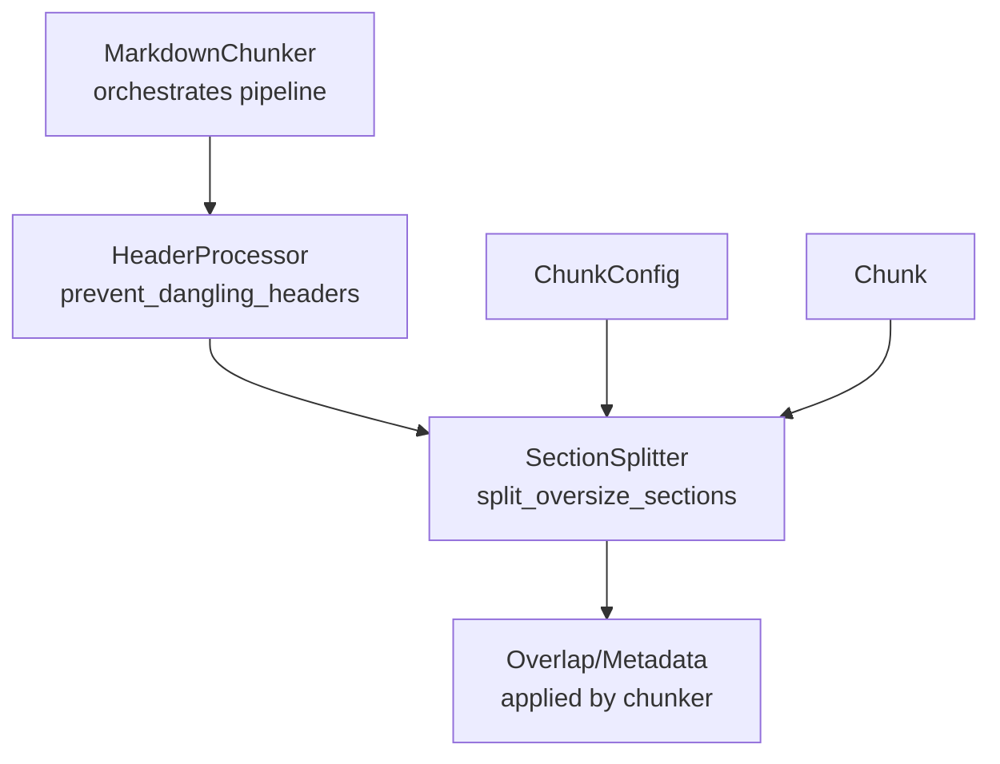
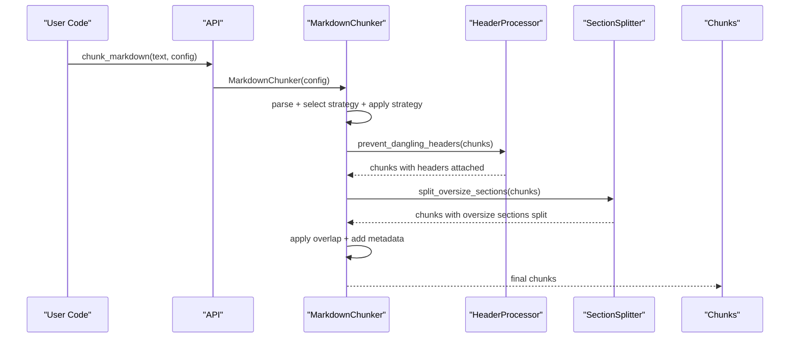
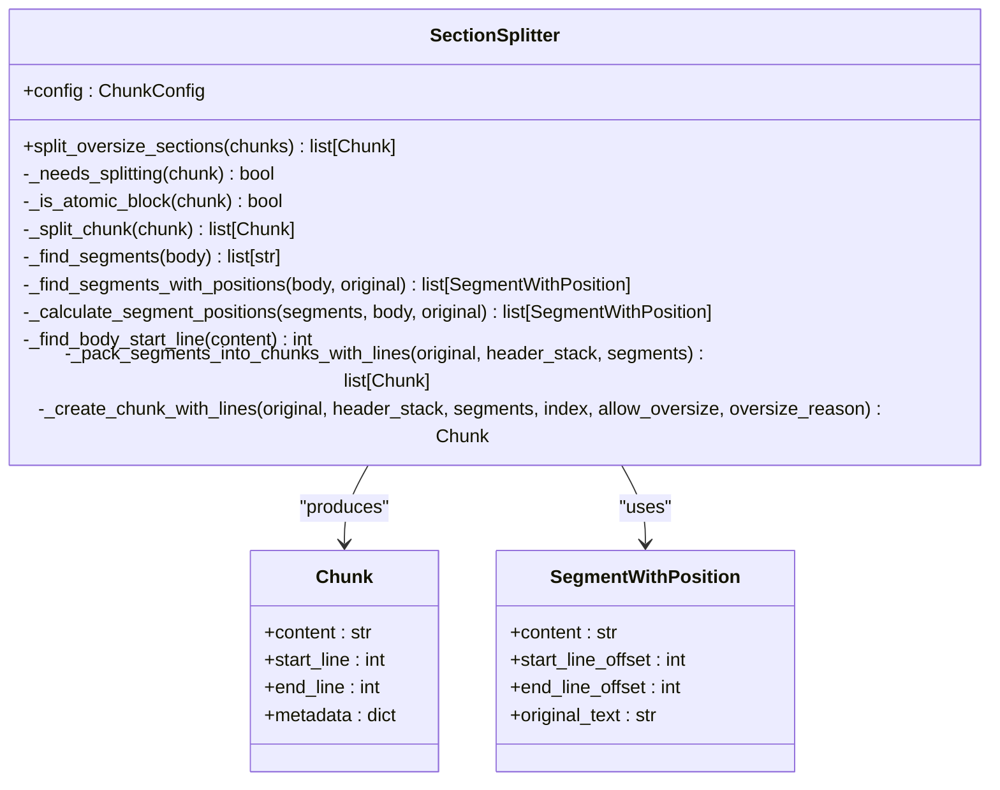
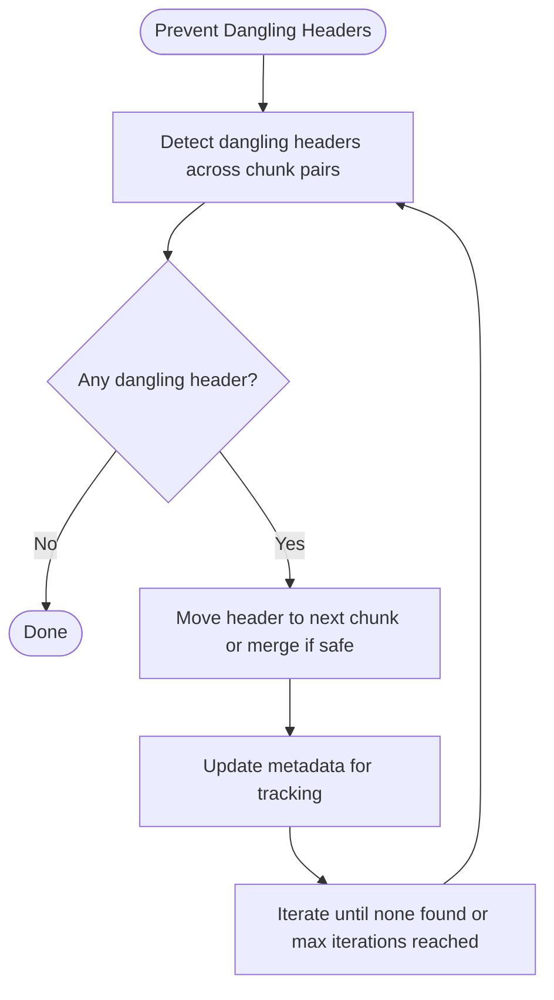
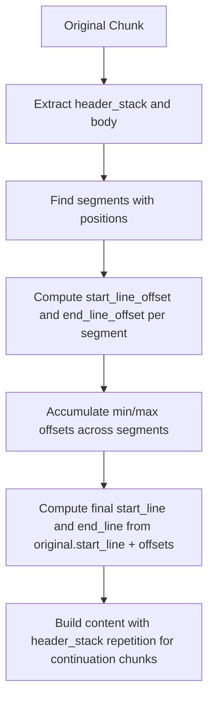
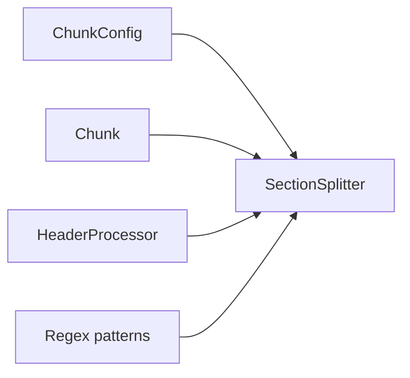

# Section Splitter

<cite>
**Referenced Files in This Document**
- [README.md](file://README.md)
- [src/chunkana/section_splitter.py](file://src/chunkana/section_splitter.py)
- [src/chunkana/chunker.py](file://src/chunkana/chunker.py)
- [src/chunkana/header_processor.py](file://src/chunkana/header_processor.py)
- [src/chunkana/config.py](file://src/chunkana/config.py)
- [src/chunkana/types.py](file://src/chunkana/types.py)
- [src/chunkana/api.py](file://src/chunkana/api.py)
- [tests/unit/test_section_splitter_line_numbers.py](file://tests/unit/test_section_splitter_line_numbers.py)
- [tests/unit/test_chunk.py](file://tests/unit/test_chunk.py)
</cite>

## Table of Contents
1. [Introduction](#introduction)
2. [Project Structure](#project-structure)
3. [Core Components](#core-components)
4. [Architecture Overview](#architecture-overview)
5. [Detailed Component Analysis](#detailed-component-analysis)
6. [Dependency Analysis](#dependency-analysis)
7. [Performance Considerations](#performance-considerations)
8. [Troubleshooting Guide](#troubleshooting-guide)
9. [Conclusion](#conclusion)

## Introduction
This document explains the Section Splitter component of Chunkana, which splits oversized chunks into multiple parts while preserving semantic boundaries and header context. It focuses on how the splitter identifies segments, calculates accurate line numbers for split chunks, and repeats header stacks in continuation chunks. It also covers the integration with the broader chunking pipeline and how tests validate line-number correctness.

## Project Structure
The Section Splitter lives in the core chunking pipeline and is invoked after header attachment and before overlap application. It relies on configuration, types, and the chunker’s orchestration.

**Diagram sources**
- [src/chunkana/chunker.py](file://src/chunkana/chunker.py#L148-L185)
- [src/chunkana/header_processor.py](file://src/chunkana/header_processor.py#L432-L482)
- [src/chunkana/section_splitter.py](file://src/chunkana/section_splitter.py#L78-L115)

**Section sources**
- [src/chunkana/chunker.py](file://src/chunkana/chunker.py#L148-L185)
- [src/chunkana/header_processor.py](file://src/chunkana/header_processor.py#L432-L482)
- [src/chunkana/section_splitter.py](file://src/chunkana/section_splitter.py#L78-L115)

## Core Components
- SectionSplitter: Implements segment discovery, packing, and accurate line-number calculation for split chunks.
- HeaderProcessor: Ensures headers are attached to their content before splitting.
- ChunkConfig: Supplies max_chunk_size and other parameters used by SectionSplitter.
- Chunk: The unit of output with content, line ranges, and metadata.

Key responsibilities:
- Detect oversize chunks that are not atomic blocks.
- Split by list items, paragraphs, or sentences (priority order).
- Repeat header_stack in continuation chunks.
- Compute accurate start_line/end_line for each split part.

**Section sources**
- [src/chunkana/section_splitter.py](file://src/chunkana/section_splitter.py#L78-L115)
- [src/chunkana/header_processor.py](file://src/chunkana/header_processor.py#L432-L482)
- [src/chunkana/config.py](file://src/chunkana/config.py#L77-L126)
- [src/chunkana/types.py](file://src/chunkana/types.py#L240-L375)

## Architecture Overview
The Section Splitter participates in the chunker’s linear pipeline. It runs after headers are attached and before overlap is applied.

**Diagram sources**
- [src/chunkana/api.py](file://src/chunkana/api.py#L18-L41)
- [src/chunkana/chunker.py](file://src/chunkana/chunker.py#L148-L185)
- [src/chunkana/header_processor.py](file://src/chunkana/header_processor.py#L432-L482)
- [src/chunkana/section_splitter.py](file://src/chunkana/section_splitter.py#L78-L115)

## Detailed Component Analysis

### SectionSplitter: Oversize Section Splitting
The SectionSplitter performs:
- Oversize detection (excluding atomic blocks and pre-approved oversize reasons).
- Segment discovery using list items, paragraphs, then sentences.
- Position-aware segmentation with accurate line offsets.
- Packing segments into chunks respecting max_chunk_size minus header_stack overhead.
- Repeating header_stack in continuation chunks and setting split metadata.

**Diagram sources**
- [src/chunkana/section_splitter.py](file://src/chunkana/section_splitter.py#L35-L697)

Key behaviors:
- Oversize detection excludes atomic blocks and pre-approved reasons.
- Segment discovery prioritizes list items, then paragraphs, then sentences.
- Line-number semantics: start_line and end_line reflect content-only ranges (not including overlap).
- Continuation chunks repeat header_stack and set continued_from_header and split_index metadata.

**Section sources**
- [src/chunkana/section_splitter.py](file://src/chunkana/section_splitter.py#L78-L115)
- [src/chunkana/section_splitter.py](file://src/chunkana/section_splitter.py#L116-L209)
- [src/chunkana/section_splitter.py](file://src/chunkana/section_splitter.py#L211-L265)
- [src/chunkana/section_splitter.py](file://src/chunkana/section_splitter.py#L266-L343)
- [src/chunkana/section_splitter.py](file://src/chunkana/section_splitter.py#L344-L423)
- [src/chunkana/section_splitter.py](file://src/chunkana/section_splitter.py#L424-L573)
- [src/chunkana/section_splitter.py](file://src/chunkana/section_splitter.py#L574-L697)

### HeaderProcessor Integration
The SectionSplitter expects headers to be attached to their content before splitting. The HeaderProcessor prevents dangling headers by moving headers into the next chunk or merging chunks when safe.

**Diagram sources**
- [src/chunkana/header_processor.py](file://src/chunkana/header_processor.py#L432-L482)
- [src/chunkana/header_processor.py](file://src/chunkana/header_processor.py#L250-L382)

**Section sources**
- [src/chunkana/header_processor.py](file://src/chunkana/header_processor.py#L432-L482)
- [src/chunkana/chunker.py](file://src/chunkana/chunker.py#L157-L165)

### Line Number Semantics and Accuracy
Split chunks must report accurate start_line and end_line for content-only ranges. The SectionSplitter computes offsets from the original chunk’s start_line and applies them to each segment.

**Diagram sources**
- [src/chunkana/section_splitter.py](file://src/chunkana/section_splitter.py#L116-L209)
- [src/chunkana/section_splitter.py](file://src/chunkana/section_splitter.py#L574-L643)

**Section sources**
- [src/chunkana/section_splitter.py](file://src/chunkana/section_splitter.py#L211-L265)
- [src/chunkana/section_splitter.py](file://src/chunkana/section_splitter.py#L574-L643)
- [tests/unit/test_section_splitter_line_numbers.py](file://tests/unit/test_section_splitter_line_numbers.py#L14-L268)

### Configuration and Constraints
SectionSplitter uses ChunkConfig.max_chunk_size to decide whether a chunk needs splitting and to compute available space for body after accounting for header_stack repetition.

- Oversize reasons: code_block_integrity, table_integrity, list_item_integrity.
- Atomic blocks are not split by SectionSplitter; they may be marked allow_oversize with a reason.

**Section sources**
- [src/chunkana/config.py](file://src/chunkana/config.py#L77-L126)
- [src/chunkana/section_splitter.py](file://src/chunkana/section_splitter.py#L99-L115)
- [src/chunkana/section_splitter.py](file://src/chunkana/section_splitter.py#L244-L265)

### API and Pipeline Integration
Public entry points return lists of Chunk objects. Internally, the chunker orchestrates parsing, strategy selection, overlap application, and metadata enrichment, with SectionSplitter operating between header attachment and overlap.

- chunk_markdown(text, config) -> list[Chunk]
- chunk_hierarchical(text, config) -> HierarchicalChunkingResult
- chunk_file_streaming(file_path, chunk_config, streaming_config) -> Iterator[Chunk]

**Section sources**
- [src/chunkana/api.py](file://src/chunkana/api.py#L18-L41)
- [src/chunkana/api.py](file://src/chunkana/api.py#L273-L305)
- [src/chunkana/chunker.py](file://src/chunkana/chunker.py#L148-L185)

## Dependency Analysis
SectionSplitter depends on:
- ChunkConfig for size limits and thresholds.
- Chunk for output structure and metadata.
- Regular expressions for header and list item detection.
- HeaderProcessor’s output to ensure header_stack presence.

**Diagram sources**
- [src/chunkana/section_splitter.py](file://src/chunkana/section_splitter.py#L70-L115)
- [src/chunkana/config.py](file://src/chunkana/config.py#L77-L126)
- [src/chunkana/types.py](file://src/chunkana/types.py#L240-L375)
- [src/chunkana/header_processor.py](file://src/chunkana/header_processor.py#L432-L482)

**Section sources**
- [src/chunkana/section_splitter.py](file://src/chunkana/section_splitter.py#L70-L115)
- [src/chunkana/chunker.py](file://src/chunkana/chunker.py#L148-L185)

## Performance Considerations
- Segment discovery favors list items and paragraphs to minimize fragmentation; sentence splitting is a fallback.
- Position calculation uses body start-line detection and line counting; empty segments are filtered out.
- Oversized chunks that cannot be split further are marked with allow_oversize and a reason, avoiding infinite loops.
- Header_stack repetition adds overhead proportional to header length; SectionSplitter ensures reasonable body space by subtracting header_stack size.

[No sources needed since this section provides general guidance]

## Troubleshooting Guide
Common issues and resolutions:
- Oversized chunks not split: Verify the chunk is not an atomic block and not already marked allow_oversize with a valid reason.
- Incorrect line numbers: Ensure prevent_dangling_headers ran before SectionSplitter and that header_stack is preserved in continuation chunks.
- Empty or header-only chunks: SectionSplitter returns the original chunk unchanged when there is no body to split.
- Excessive fragmentation: Adjust max_chunk_size or rely on list-item/paragraph splitting to reduce fragmentation.

Validation references:
- Chunk validation (start_line, end_line, non-empty content) ensures structural integrity.
- Tests confirm accurate line-number computation for split chunks.

**Section sources**
- [src/chunkana/section_splitter.py](file://src/chunkana/section_splitter.py#L99-L115)
- [src/chunkana/section_splitter.py](file://src/chunkana/section_splitter.py#L266-L343)
- [tests/unit/test_chunk.py](file://tests/unit/test_chunk.py#L13-L66)
- [tests/unit/test_section_splitter_line_numbers.py](file://tests/unit/test_section_splitter_line_numbers.py#L14-L268)

## Conclusion
The Section Splitter is a precision component that safely splits oversized sections while preserving semantic boundaries and header context. Its careful handling of line numbers, header_stack repetition, and oversize reasons integrates cleanly into the chunker’s pipeline. Together with HeaderProcessor and the broader chunking orchestration, it produces reliable, structure-aware chunks suitable for RAG and retrieval applications.