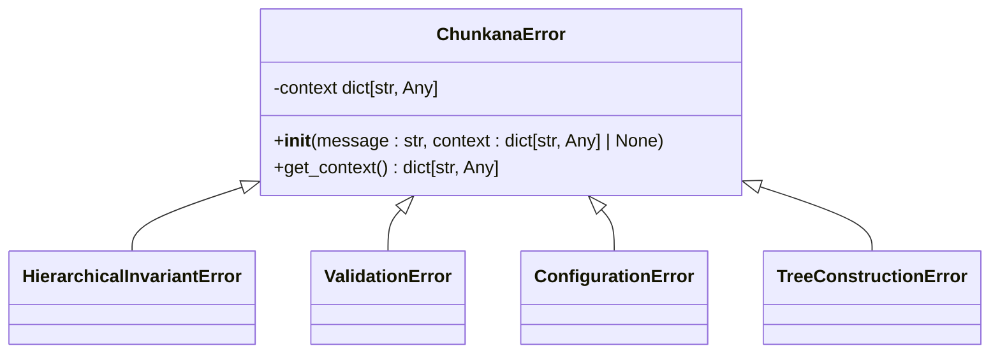
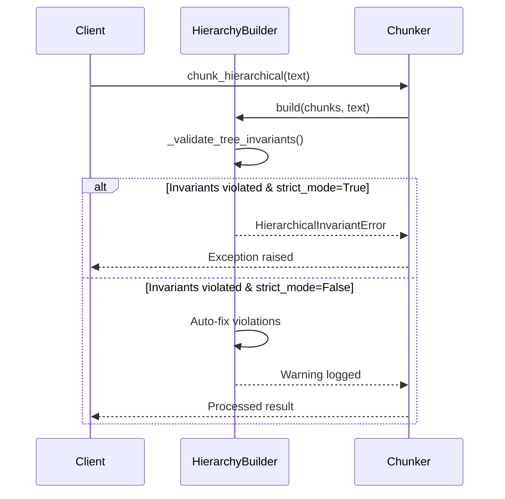
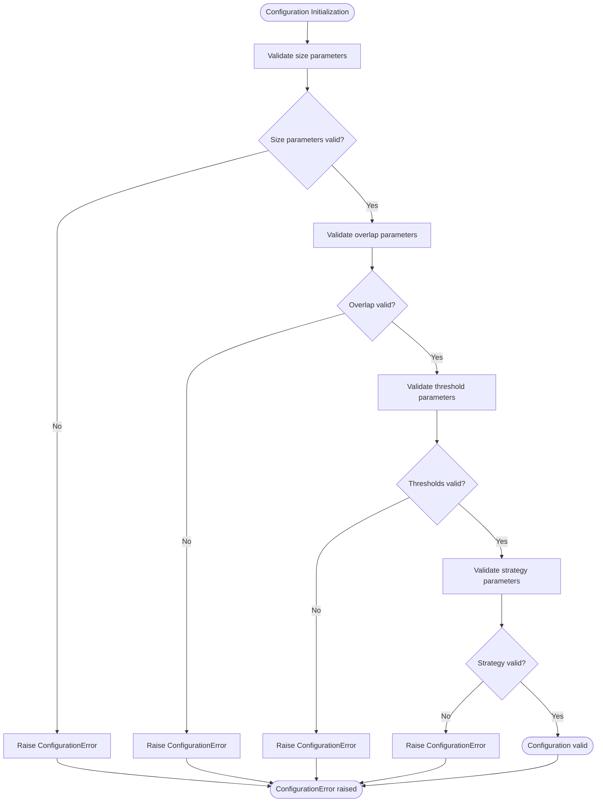
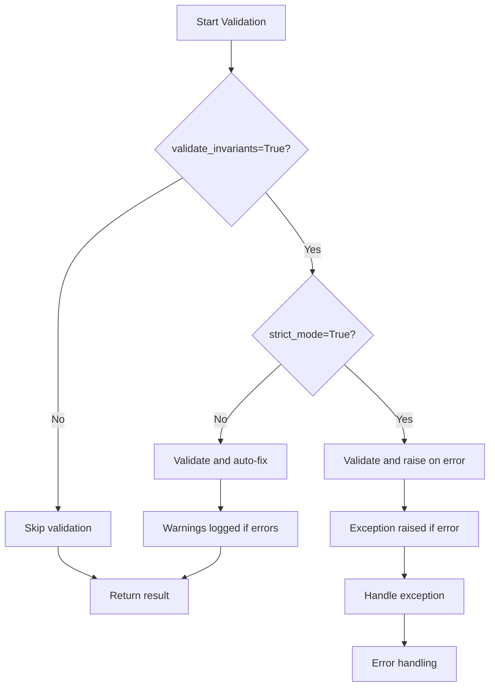
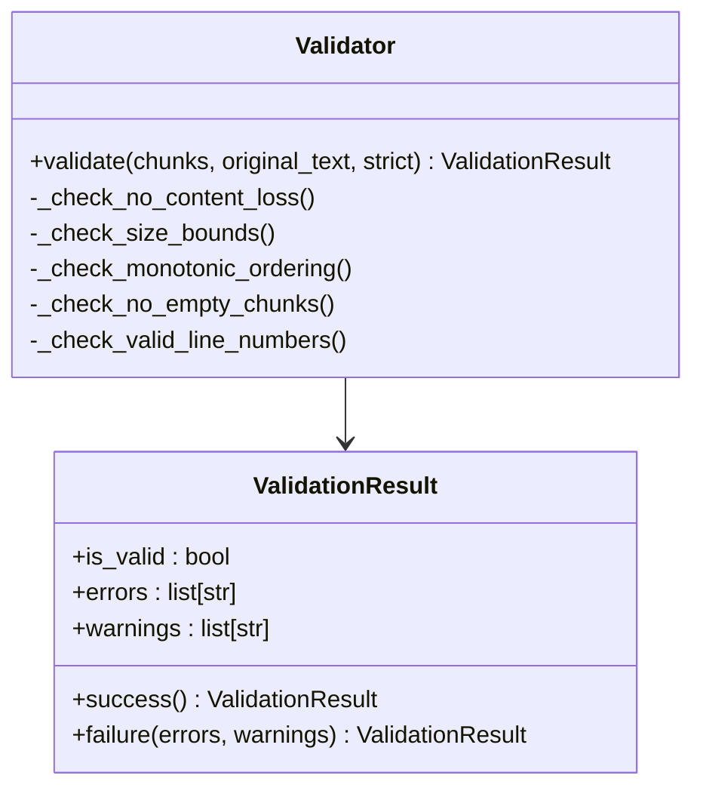
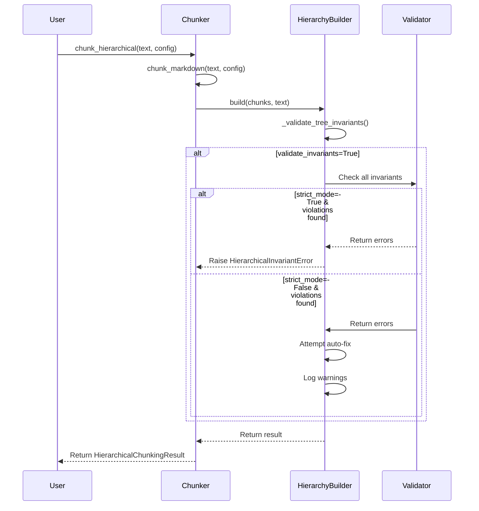
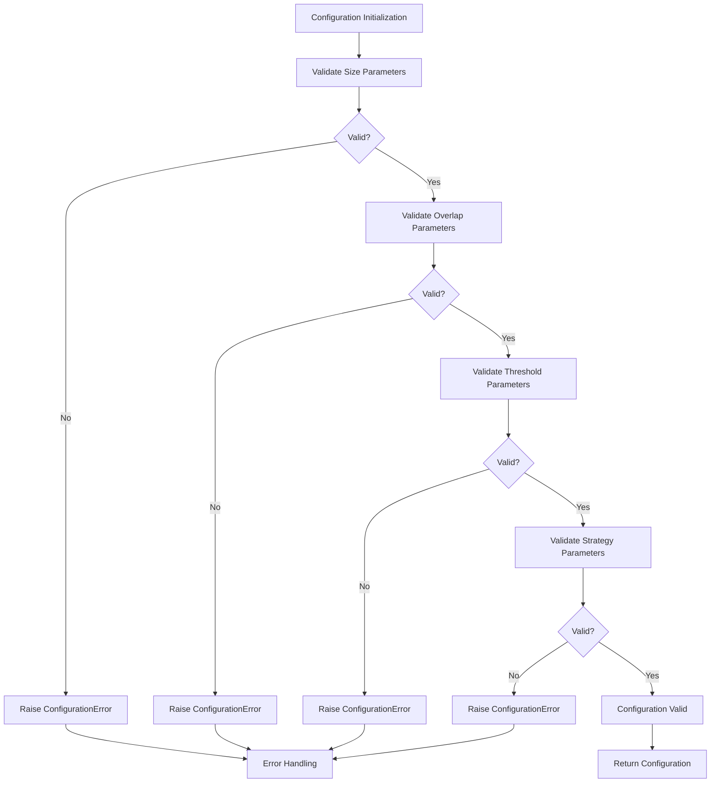

# Errors

<cite>
**Referenced Files in This Document**   
- [exceptions.py](file://src/chunkana/exceptions.py)
- [errors.md](file://docs/errors.md)
- [hierarchy.py](file://src/chunkana/hierarchy.py)
- [config.py](file://src/chunkana/config.py)
- [validator.py](file://src/chunkana/validator.py)
- [api.py](file://src/chunkana/api.py)
- [chunker.py](file://src/chunkana/chunker.py)
- [test_invariant_validation.py](file://tests/unit/test_invariant_validation.py)
- [test_hierarchical_invariants.py](file://tests/property/test_hierarchical_invariants.py)
</cite>

## Table of Contents
1. [Introduction](#introduction)
2. [Exception Types](#exception-types)
3. [Error Handling Patterns](#error-handling-patterns)
4. [Validation and Invariant Checking](#validation-and-invariant-checking)
5. [Configuration Error Handling](#configuration-error-handling)
6. [Common Issues and Solutions](#common-issues-and-solutions)
7. [Debugging Strategies](#debugging-strategies)
8. [Related Documentation](#related-documentation)

## Introduction

This document provides a comprehensive overview of error handling in the Chunkana library. It covers the exception hierarchy, error handling patterns, validation mechanisms, and practical solutions for common issues. The library implements a robust error handling system designed to provide actionable feedback while maintaining data integrity during markdown chunking operations.

The error system is built around specific exception types that inherit from a common base class, providing consistent error reporting and debugging context. The library distinguishes between different error categories including configuration errors, validation failures, hierarchical invariant violations, and tree construction issues.

**Section sources**
- [exceptions.py](file://src/chunkana/exceptions.py#L1-L248)
- [errors.md](file://docs/errors.md#L1-L460)

## Exception Types

### ChunkanaError (Base Class)

All Chunkana-specific exceptions inherit from the `ChunkanaError` base class, which provides a consistent interface for error reporting and debugging. This base exception includes a human-readable message and a context dictionary containing additional debugging information.



**Diagram sources**
- [exceptions.py](file://src/chunkana/exceptions.py#L11-L32)

### HierarchicalInvariantError

This exception is raised when hierarchical tree invariants are violated during chunking operations. It provides specific information about which invariant failed and includes actionable suggestions for resolution.

The error includes the following attributes:
- `chunk_id`: ID of the chunk that violates the invariant
- `invariant`: Name of the violated invariant
- `details`: Specific details about the violation
- `suggested_fix`: Suggested resolution for the issue

Common invariants that trigger this exception include:
- `is_leaf_consistency`: Ensures is_leaf=True when children_ids is empty, is_leaf=False when children_ids has elements
- `parent_child_bidirectionality`: Verifies that parent's children_ids includes this chunk and child's parent_id points to parent
- `content_range_consistency`: Checks that chunk content matches its start_line and end_line range
- `orphaned_chunk`: Identifies chunks with non-existent parents
- `circular_reference`: Detects circular references in parent-child relationships



**Diagram sources**
- [exceptions.py](file://src/chunkana/exceptions.py#L34-L87)
- [hierarchy.py](file://src/chunkana/hierarchy.py#L812-L965)

### ValidationError

Raised when chunk validation fails due to invalid data or configuration issues. This exception provides information about validation failures with context for debugging and resolution.

Key attributes include:
- `error_type`: Type of validation error
- `chunk_id`: ID of problematic chunk (if applicable)
- `suggested_fix`: Suggested resolution for the issue

Common validation errors include:
- Invalid line ranges (start_line > end_line)
- Missing required metadata fields
- Corrupted chunk data during serialization/deserialization
- Content loss (output doesn't match input)
- Size bounds violations (chunks exceeding max_chunk_size)
- Empty chunks (content.strip() is empty)
- Invalid line numbers (out of document range)

**Section sources**
- [exceptions.py](file://src/chunkana/exceptions.py#L102-L152)
- [validator.py](file://src/chunkana/validator.py#L32-L221)

### ConfigurationError

Raised when configuration parameters are invalid or incompatible. This exception provides guidance on valid parameter combinations and values.

The error includes:
- `parameter`: Name of the problematic parameter
- `value`: Invalid value that was provided
- `valid_values`: List of valid values (if applicable)

Common configuration issues that trigger this exception:
- overlap_size larger than max_chunk_size
- Negative size parameters
- Invalid strategy names
- Incompatible parameter combinations
- Threshold values outside valid ranges



**Diagram sources**
- [exceptions.py](file://src/chunkana/exceptions.py#L155-L196)
- [config.py](file://src/chunkana/config.py#L138-L184)

### TreeConstructionError

Raised when hierarchical tree construction fails. This exception provides information about which relationships couldn't be established during tree building.

Attributes include:
- `operation`: The operation that failed (e.g., "link_parent", "add_child")
- `chunk_id`: ID of the primary chunk involved
- `related_chunk_id`: ID of related chunk (if applicable)
- `reason`: Specific reason for failure

This exception typically occurs due to:
- Malformed document structure
- Missing or duplicate headers
- Circular references in hierarchy
- Inconsistent parent-child relationships

**Section sources**
- [exceptions.py](file://src/chunkana/exceptions.py#L199-L247)

## Error Handling Patterns

### Strict vs. Non-Strict Mode

The library implements a dual-mode error handling system that allows users to choose between strict and non-strict behavior. This pattern provides flexibility for different use cases, from development (where detailed error reporting is valuable) to production (where robustness is prioritized).

In strict mode:
- Errors raise exceptions immediately
- Processing stops at the first violation
- Full error details are provided

In non-strict mode:
- Errors are logged as warnings
- Auto-fixing is attempted where possible
- Processing continues despite violations



**Diagram sources**
- [hierarchy.py](file://src/chunkana/hierarchy.py#L949-L959)

### Contextual Error Information

All exceptions in the library include contextual information to aid debugging. The context dictionary contains relevant details about the error condition, making it easier to diagnose and resolve issues.

The context typically includes:
- Chunk identifiers and metadata
- Configuration parameters
- Line number information
- Validation details
- Suggested fixes

This approach enables developers to quickly identify the root cause of issues without needing to reproduce complex scenarios.

**Section sources**
- [exceptions.py](file://src/chunkana/exceptions.py#L18-L31)

## Validation and Invariant Checking

### Domain Properties Validation

The library validates chunking results against five core domain properties (PROP-1 through PROP-5) to ensure data integrity:



**Diagram sources**
- [validator.py](file://src/chunkana/validator.py#L32-L221)

#### PROP-1: No Content Loss

Ensures that the total content in chunks approximately equals the original document. Allows for some variance due to overlap and whitespace normalization. If content loss exceeds 10%, a warning or error is generated.

#### PROP-2: Size Bounds

Verifies that all chunks respect the max_chunk_size limit unless explicitly marked as oversize. Oversize chunks must have a valid reason specified in the metadata (code_block_integrity, table_integrity, or section_integrity).

#### PROP-3: Monotonic Ordering

Confirms that chunks are ordered by their start_line values, ensuring that the chunk sequence matches the document structure.

#### PROP-4: No Empty Chunks

Checks that all chunks have non-empty content after stripping whitespace. Empty chunks can cause issues in downstream processing.

#### PROP-5: Valid Line Numbers

Validates that all line numbers are within proper bounds (start_line >= 1, end_line >= start_line, end_line <= total document lines).

**Section sources**
- [validator.py](file://src/chunkana/validator.py#L64-L198)

### Hierarchical Invariant Validation

The hierarchy module performs comprehensive validation of tree structure invariants. This validation occurs after chunk construction and ensures the integrity of parent-child relationships.

The validation process checks three core invariants:
1. **is_leaf consistency**: is_leaf flag matches whether children_ids is empty
2. **Parent-child bidirectionality**: parent-child relationships are mutual
3. **Content range consistency**: root chunks have consistent content ranges

When validate_invariants is True, the system performs these checks. In strict_mode, violations raise HierarchicalInvariantError. In non-strict mode, the system attempts to auto-fix violations and logs warnings.



**Diagram sources**
- [hierarchy.py](file://src/chunkana/hierarchy.py#L812-L965)
- [test_invariant_validation.py](file://tests/unit/test_invariant_validation.py#L18-L321)

## Configuration Error Handling

### Parameter Validation

The configuration system performs comprehensive validation of parameters during initialization. This proactive approach catches configuration errors early, before they can cause issues during chunking operations.

Key validation checks include:
- Size parameters: max_chunk_size and min_chunk_size must be positive
- Overlap constraints: overlap_size must be non-negative and less than max_chunk_size
- Threshold validation: code_threshold, list_ratio_threshold must be between 0 and 1
- Strategy validation: strategy_override must be one of the valid strategies
- Context parameters: max_context_chars_before/after must be non-negative

When invalid parameters are detected, the system raises ConfigurationError with specific details about the issue and valid value ranges.



**Diagram sources**
- [config.py](file://src/chunkana/config.py#L138-L184)

### Legacy Parameter Support

The library includes backward compatibility support for legacy parameters through the from_legacy class method. This method maps old parameter names to new ones and issues deprecation warnings, allowing for a smooth transition during upgrades.

Removed parameters are ignored with appropriate warnings, while renamed parameters are mapped with deprecation notices. This approach ensures that existing code continues to work while guiding users toward the updated API.

**Section sources**
- [config.py](file://src/chunkana/config.py#L254-L307)

## Common Issues and Solutions

### Empty or Very Small Chunks

**Symptoms**: Chunks with little or no content

**Causes**:
- Headers without content
- min_chunk_size set too low
- Document structure issues

**Solutions**:
- Increase minimum chunk size
- Check for empty chunks in the output
- Use configuration with appropriate min_chunk_size

### Chunks Too Large

**Symptoms**: Chunks exceeding expected size limits

**Causes**:
- Large atomic blocks (code, tables)
- max_chunk_size set too high
- Strategy not handling content type well

**Solutions**:
- Reduce maximum chunk size
- Force specific strategy (e.g., code_aware)
- Check chunk sizes and adjust configuration

### Code Blocks Being Split

**Symptoms**: Code blocks broken across multiple chunks

**Causes**:
- preserve_atomic_blocks=False
- Very small max_chunk_size
- Strategy not detecting code content

**Solutions**:
- Ensure atomic blocks are preserved
- Increase max_chunk_size
- Force code-aware strategy

### Missing Header Paths

**Symptoms**: Chunks with empty or generic header paths

**Causes**:
- Document without headers
- Malformed header structure
- Content before first header

**Solutions**:
- Enable preamble extraction
- Check header paths in output
- Validate document structure

### Memory Issues with Large Documents

**Symptoms**: Out of memory errors or slow processing

**Causes**:
- Loading entire document into memory
- Not using streaming API
- Very large atomic blocks

**Solutions**:
- Use streaming for large files
- Process chunks immediately
- Monitor memory usage

**Section sources**
- [errors.md](file://docs/errors.md#L130-L243)

## Debugging Strategies

### Enable Debug Mode

The library provides debug mode through configuration options that enable additional validation and debug information. Setting validate_invariants=True provides detailed context about chunking operations and potential issues.

```python
from chunkana import MarkdownChunker, ChunkConfig

# Enable validation and debug info
config = ChunkConfig(validate_invariants=True)
chunker = MarkdownChunker(config)

try:
    chunks = chunk_markdown(text, config)
except Exception as e:
    print(f"Debug info: {e.get_context() if hasattr(e, 'get_context') else 'N/A'}")
```

### Analyze Document Structure

Before chunking, analyze the document structure to identify potential issues:

```python
def analyze_document(text):
    """Analyze document structure for debugging."""
    lines = text.split('\n')
    
    # Count different elements
    headers = [i for i, line in enumerate(lines) if line.strip().startswith('#')]
    code_blocks = [i for i, line in enumerate(lines) if line.strip().startswith('```')]
    tables = [i for i, line in enumerate(lines) if '|' in line]
    
    return {
        'total_lines': len(lines),
        'headers': headers,
        'code_blocks': code_blocks,
        'tables': tables,
    }
```

### Test with Minimal Examples

Use minimal test cases to isolate issues:

```python
def test_minimal_case():
    """Test with minimal example to isolate issues."""
    
    minimal_text = """
# Test Header

Some content here.

```python
def test():
    return True
```

More content.
"""
    
    try:
        chunks = chunk_markdown(minimal_text)
        print(f"Minimal test passed: {len(chunks)} chunks")
        return True
    except Exception as e:
        print(f"Minimal test failed: {e}")
        return False
```

### Compare Strategies

Test different chunking strategies to identify the best approach:

```python
def compare_strategies(text):
    """Compare results from different strategies."""
    
    strategies = ["code_aware", "list_aware", "structural", "fallback"]
    
    for strategy in strategies:
        try:
            config = ChunkConfig(strategy_override=strategy)
            chunks = chunk_markdown(text, config)
            
            print(f"\n{strategy} strategy:")
            print(f"  Chunks: {len(chunks)}")
            print(f"  Avg size: {sum(c.size for c in chunks) / len(chunks):.0f}")
            print(f"  Code chunks: {sum(1 for c in chunks if c.metadata['has_code'])}")
            
        except Exception as e:
            print(f"{strategy} strategy failed: {e}")
```

**Section sources**
- [errors.md](file://docs/errors.md#L271-L372)

## Related Documentation

- **[FAQ](faq.md)** - Frequently asked questions
- **[Debug Mode](debug_mode.md)** - Understanding chunking behavior
- **[Configuration](config.md)** - Configuration options
- **[Examples](examples.md)** - Practical usage examples