# Examples

<cite>
**Referenced Files in This Document**
- [README.md](file://README.md)
- [docs/examples.md](file://docs/examples.md)
- [docs/examples/advanced-usage.md](file://docs/examples/advanced-usage.md)
- [src/chunkana/__init__.py](file://src/chunkana/__init__.py)
- [src/chunkana/api.py](file://src/chunkana/api.py)
- [src/chunkana/chunker.py](file://src/chunkana/chunker.py)
- [src/chunkana/config.py](file://src/chunkana/config.py)
- [src/chunkana/types.py](file://src/chunkana/types.py)
- [src/chunkana/strategies/base.py](file://src/chunkana/strategies/base.py)
- [src/chunkana/strategies/code_aware.py](file://src/chunkana/strategies/code_aware.py)
- [src/chunkana/renderers/formatters.py](file://src/chunkana/renderers/formatters.py)
- [src/chunkana/streaming/streaming_chunker.py](file://src/chunkana/streaming/streaming_chunker.py)
- [src/chunkana/adaptive_sizing.py](file://src/chunkana/adaptive_sizing.py)
- [src/chunkana/table_grouping.py](file://src/chunkana/table_grouping.py)
</cite>

## Table of Contents
1. [Introduction](#introduction)
2. [Project Structure](#project-structure)
3. [Core Components](#core-components)
4. [Architecture Overview](#architecture-overview)
5. [Detailed Component Analysis](#detailed-component-analysis)
6. [Dependency Analysis](#dependency-analysis)
7. [Performance Considerations](#performance-considerations)
8. [Troubleshooting Guide](#troubleshooting-guide)
9. [Conclusion](#conclusion)
10. [Appendices](#appendices)

## Introduction
This document presents practical examples and usage patterns for Chunkana, focusing on real-world scenarios such as basic chunking, RAG pipeline integration, code documentation processing, scientific documents with LaTeX, large document streaming, custom output formats, and robust error handling. It complements the quick start and advanced usage guides with concrete workflows and best practices.

## Project Structure
Chunkana exposes a concise public API and a modular internal architecture:
- Public API surface: convenience functions for chunking, analysis, hierarchical chunking, streaming, and iteration.
- Core chunker orchestrates parsing, strategy selection, overlap application, and validation.
- Strategies encapsulate chunking logic for different content types.
- Renderers convert chunks into various output formats.
- Streaming chunker enables memory-efficient processing of large files.
- Configuration centralizes behavior toggles and thresholds.

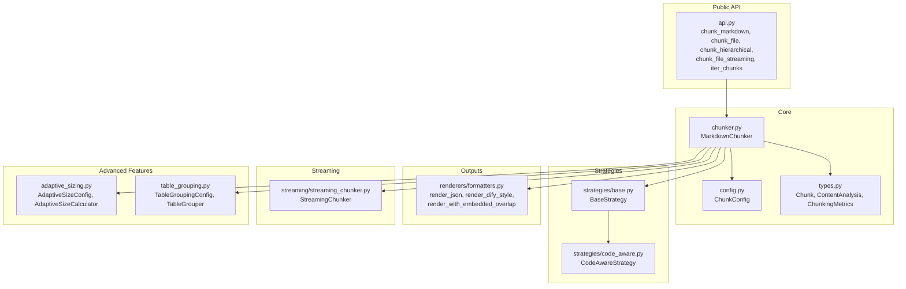

**Diagram sources**
- [src/chunkana/api.py](file://src/chunkana/api.py#L1-L305)
- [src/chunkana/chunker.py](file://src/chunkana/chunker.py#L1-L200)
- [src/chunkana/config.py](file://src/chunkana/config.py#L1-L120)
- [src/chunkana/types.py](file://src/chunkana/types.py#L240-L370)
- [src/chunkana/strategies/base.py](file://src/chunkana/strategies/base.py#L1-L120)
- [src/chunkana/strategies/code_aware.py](file://src/chunkana/strategies/code_aware.py#L1-L120)
- [src/chunkana/renderers/formatters.py](file://src/chunkana/renderers/formatters.py#L1-L80)
- [src/chunkana/streaming/streaming_chunker.py](file://src/chunkana/streaming/streaming_chunker.py#L1-L99)
- [src/chunkana/adaptive_sizing.py](file://src/chunkana/adaptive_sizing.py#L1-L120)
- [src/chunkana/table_grouping.py](file://src/chunkana/table_grouping.py#L1-L120)

**Section sources**
- [src/chunkana/__init__.py](file://src/chunkana/__init__.py#L24-L73)
- [src/chunkana/api.py](file://src/chunkana/api.py#L1-L120)

## Core Components
- Public API functions: chunk_markdown, chunk_file, chunk_hierarchical, chunk_file_streaming, iter_chunks, analyze_markdown, chunk_with_metrics, chunk_with_analysis.
- Core chunker: orchestrates parsing, strategy selection, overlap, validation, and metadata enrichment.
- Types: Chunk, ContentAnalysis, ChunkingMetrics, ChunkingResult define the data contract.
- Strategies: BaseStrategy and CodeAwareStrategy implement content-aware chunking.
- Renderers: JSON, Dify-compatible, and overlap-embedding formatters.
- Streaming: StreamingChunker processes files in windows for memory efficiency.
- Advanced features: Adaptive sizing and table grouping enhance quality and retrieval.

**Section sources**
- [src/chunkana/api.py](file://src/chunkana/api.py#L18-L120)
- [src/chunkana/chunker.py](file://src/chunkana/chunker.py#L87-L186)
- [src/chunkana/types.py](file://src/chunkana/types.py#L240-L370)
- [src/chunkana/strategies/base.py](file://src/chunkana/strategies/base.py#L1-L120)
- [src/chunkana/strategies/code_aware.py](file://src/chunkana/strategies/code_aware.py#L1-L120)
- [src/chunkana/renderers/formatters.py](file://src/chunkana/renderers/formatters.py#L1-L80)
- [src/chunkana/streaming/streaming_chunker.py](file://src/chunkana/streaming/streaming_chunker.py#L1-L99)
- [src/chunkana/adaptive_sizing.py](file://src/chunkana/adaptive_sizing.py#L1-L120)
- [src/chunkana/table_grouping.py](file://src/chunkana/table_grouping.py#L1-L120)

## Architecture Overview
The chunking pipeline follows a linear, validated flow with optional overlap and metadata enrichment.

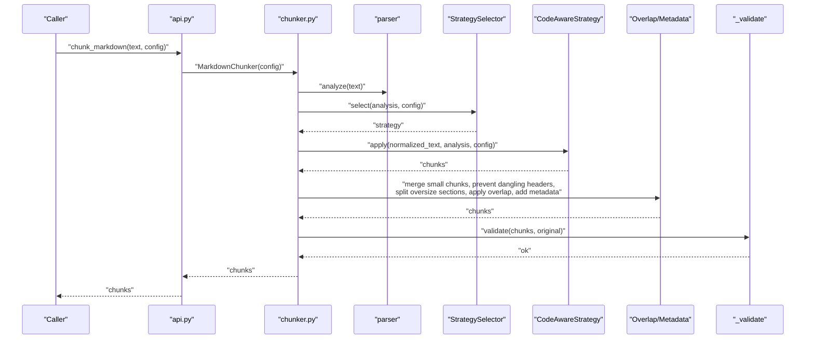

**Diagram sources**
- [src/chunkana/api.py](file://src/chunkana/api.py#L18-L120)
- [src/chunkana/chunker.py](file://src/chunkana/chunker.py#L113-L186)
- [src/chunkana/strategies/base.py](file://src/chunkana/strategies/base.py#L1-L120)
- [src/chunkana/strategies/code_aware.py](file://src/chunkana/strategies/code_aware.py#L1-L120)

## Detailed Component Analysis

### Basic Chunking Examples
- Simple document chunking with default configuration.
- Custom configuration for chunk size and overlap.
- Output inspection via metadata fields (header_path, content_type, line ranges).

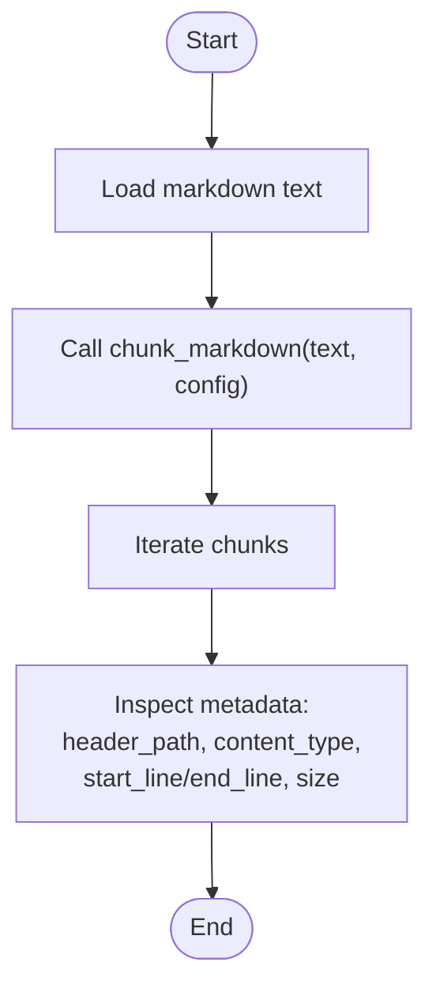

**Diagram sources**
- [src/chunkana/api.py](file://src/chunkana/api.py#L18-L68)
- [src/chunkana/types.py](file://src/chunkana/types.py#L240-L370)

**Section sources**
- [docs/examples.md](file://docs/examples.md#L17-L76)
- [docs/examples.md](file://docs/examples.md#L78-L92)

### RAG Pipeline Integration
- Vector database preparation: configure chunk size and overlap, render to JSON, enrich with source metadata.
- Retrieval filtering: filter by content_type, has_code, or header containment.

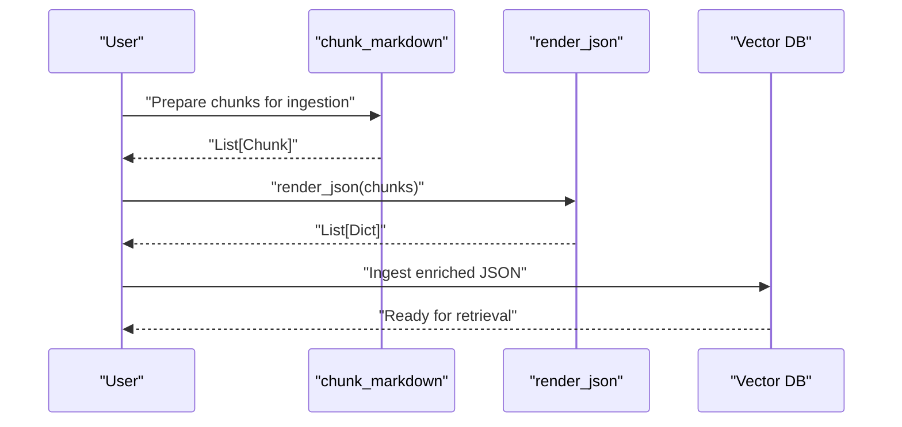

**Diagram sources**
- [src/chunkana/api.py](file://src/chunkana/api.py#L18-L68)
- [src/chunkana/renderers/formatters.py](file://src/chunkana/renderers/formatters.py#L1-L28)
- [docs/examples.md](file://docs/examples.md#L96-L141)

**Section sources**
- [docs/examples.md](file://docs/examples.md#L96-L141)
- [docs/examples.md](file://docs/examples.md#L143-L173)

### Code Documentation Processing
- Optimized configuration for code-heavy documents: higher max_chunk_size, lower code_threshold, code-context binding, and context window sizes.
- Analysis of code distribution and strategy usage.

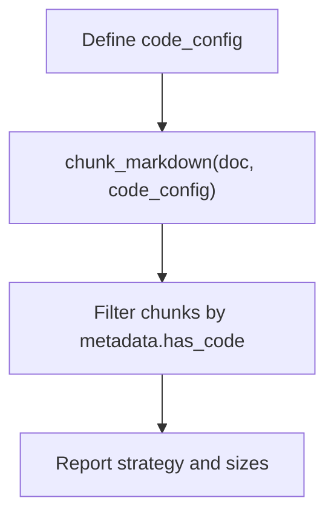

**Diagram sources**
- [src/chunkana/config.py](file://src/chunkana/config.py#L17-L120)
- [src/chunkana/strategies/code_aware.py](file://src/chunkana/strategies/code_aware.py#L1-L120)
- [docs/examples.md](file://docs/examples.md#L177-L271)

**Section sources**
- [docs/examples.md](file://docs/examples.md#L177-L271)

### Scientific Documents with LaTeX
- Configuration enabling LaTeX preservation and atomic block handling.
- Detection of LaTeX content in chunks.

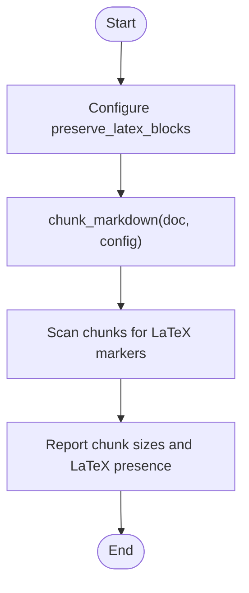

**Diagram sources**
- [src/chunkana/config.py](file://src/chunkana/config.py#L115-L123)
- [src/chunkana/strategies/base.py](file://src/chunkana/strategies/base.py#L168-L209)
- [docs/examples.md](file://docs/examples.md#L275-L341)

**Section sources**
- [docs/examples.md](file://docs/examples.md#L275-L341)

### Large Document Processing (Streaming)
- Memory-efficient streaming chunking for large files.
- Batch processing multiple files with optional parallelism.

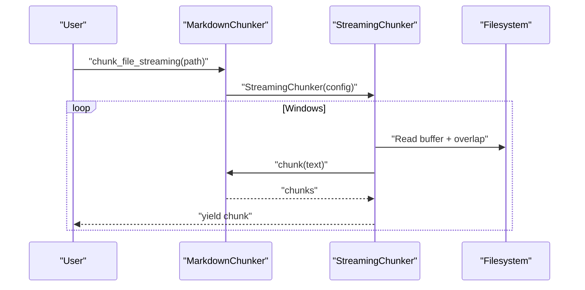

**Diagram sources**
- [src/chunkana/api.py](file://src/chunkana/api.py#L228-L271)
- [src/chunkana/streaming/streaming_chunker.py](file://src/chunkana/streaming/streaming_chunker.py#L1-L99)
- [docs/examples.md](file://docs/examples.md#L344-L386)
- [docs/examples.md](file://docs/examples.md#L388-L428)

**Section sources**
- [docs/examples.md](file://docs/examples.md#L344-L386)
- [docs/examples.md](file://docs/examples.md#L388-L428)

### Custom Output Formats
- JSON rendering for ingestion.
- Custom renderer creation and XML export.

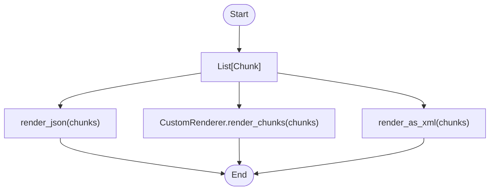

**Diagram sources**
- [src/chunkana/renderers/formatters.py](file://src/chunkana/renderers/formatters.py#L1-L80)
- [docs/examples.md](file://docs/examples.md#L430-L527)

**Section sources**
- [docs/examples.md](file://docs/examples.md#L430-L527)

### Error Handling and Validation
- Robust processing with fallback strategies and fallback configuration.
- Validation of chunk quality and completeness.

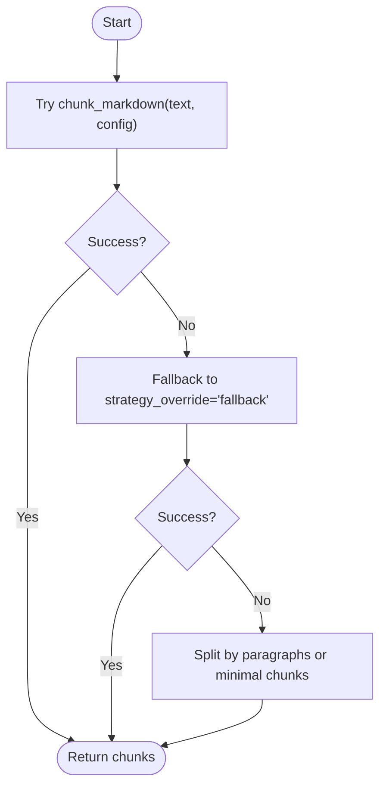

**Diagram sources**
- [src/chunkana/api.py](file://src/chunkana/api.py#L18-L68)
- [src/chunkana/config.py](file://src/chunkana/config.py#L175-L184)
- [docs/examples.md](file://docs/examples.md#L529-L621)

**Section sources**
- [docs/examples.md](file://docs/examples.md#L529-L621)
- [docs/examples.md](file://docs/examples.md#L623-L686)

### Advanced Usage Patterns
- Streaming large files with configurable buffer and overlap.
- Adaptive sizing: compute optimal chunk size based on content complexity.
- Table grouping: keep related tables together with configurable thresholds.
- Hierarchical chunking: build navigable chunk trees with validation.
- Custom renderers: implement BaseRenderer for specialized outputs.
- Performance tuning: trade-offs between memory, speed, and quality.

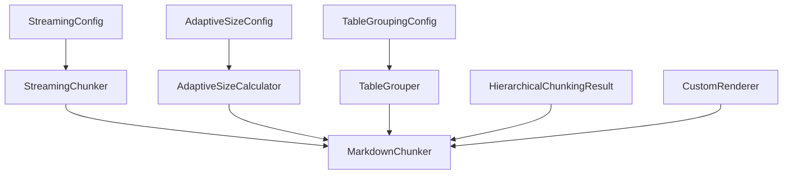

**Diagram sources**
- [docs/examples/advanced-usage.md](file://docs/examples/advanced-usage.md#L1-L120)
- [src/chunkana/adaptive_sizing.py](file://src/chunkana/adaptive_sizing.py#L1-L120)
- [src/chunkana/table_grouping.py](file://src/chunkana/table_grouping.py#L1-L120)
- [src/chunkana/streaming/streaming_chunker.py](file://src/chunkana/streaming/streaming_chunker.py#L1-L99)
- [src/chunkana/chunker.py](file://src/chunkana/chunker.py#L226-L257)
- [src/chunkana/renderers/formatters.py](file://src/chunkana/renderers/formatters.py#L1-L80)

**Section sources**
- [docs/examples/advanced-usage.md](file://docs/examples/advanced-usage.md#L1-L120)
- [docs/examples/advanced-usage.md](file://docs/examples/advanced-usage.md#L121-L203)
- [docs/examples/advanced-usage.md](file://docs/examples/advanced-usage.md#L204-L255)
- [docs/examples/advanced-usage.md](file://docs/examples/advanced-usage.md#L256-L326)

## Dependency Analysis
Key dependencies and relationships:
- Public API depends on MarkdownChunker and StreamingChunker.
- MarkdownChunker depends on StrategySelector, parsers, and validators.
- Strategies depend on BaseStrategy and types.
- Renderers depend on Chunk.
- StreamingChunker composes MarkdownChunker and buffer/window utilities.

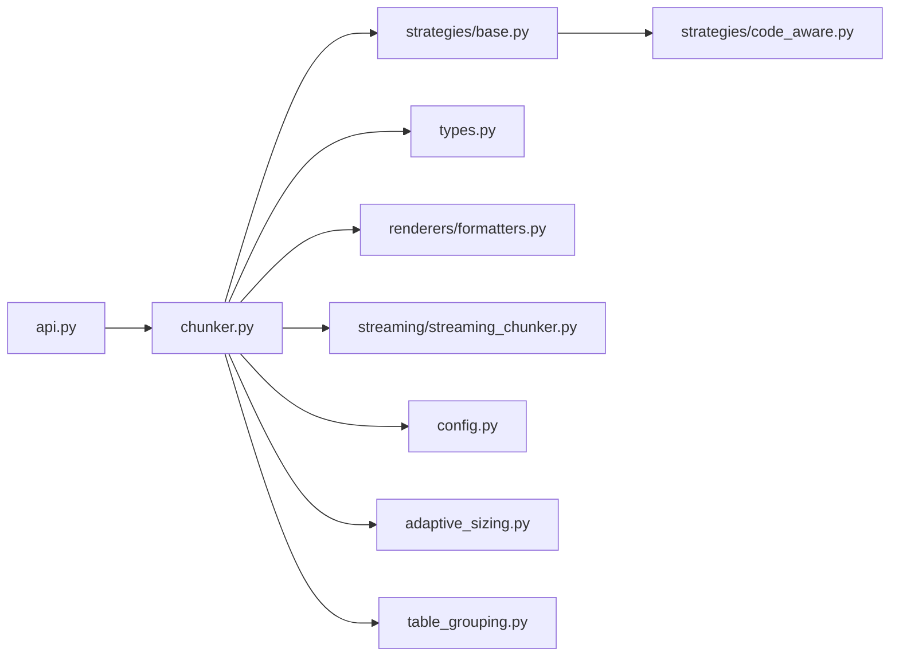

**Diagram sources**
- [src/chunkana/api.py](file://src/chunkana/api.py#L1-L120)
- [src/chunkana/chunker.py](file://src/chunkana/chunker.py#L1-L120)
- [src/chunkana/strategies/base.py](file://src/chunkana/strategies/base.py#L1-L120)
- [src/chunkana/strategies/code_aware.py](file://src/chunkana/strategies/code_aware.py#L1-L120)
- [src/chunkana/types.py](file://src/chunkana/types.py#L240-L370)
- [src/chunkana/renderers/formatters.py](file://src/chunkana/renderers/formatters.py#L1-L80)
- [src/chunkana/streaming/streaming_chunker.py](file://src/chunkana/streaming/streaming_chunker.py#L1-L99)
- [src/chunkana/config.py](file://src/chunkana/config.py#L1-L120)
- [src/chunkana/adaptive_sizing.py](file://src/chunkana/adaptive_sizing.py#L1-L120)
- [src/chunkana/table_grouping.py](file://src/chunkana/table_grouping.py#L1-L120)

**Section sources**
- [src/chunkana/__init__.py](file://src/chunkana/__init__.py#L24-L73)

## Performance Considerations
- Use adaptive sizing for content-aware chunk sizes.
- Enable table grouping for table-heavy documents to reduce fragmentation.
- Prefer streaming for large files to limit memory usage.
- Tune overlap_size and overlap_cap_ratio to balance context continuity and index size.
- Disable expensive validations in strict_mode when throughput is prioritized.

[No sources needed since this section provides general guidance]

## Troubleshooting Guide
- Fallback strategies: when hierarchical invariants fail, switch to non-strict mode or force fallback strategy.
- Validation: use validate_chunks to detect coverage, empty chunks, small chunks, and metadata issues.
- Error recovery: catch ChunkanaError and retry with adjusted configuration or revert to paragraph splitting.

**Section sources**
- [docs/examples.md](file://docs/examples.md#L529-L621)
- [docs/examples.md](file://docs/examples.md#L623-L686)

## Conclusion
Chunkana’s examples demonstrate practical workflows for diverse document types and deployment scenarios. By combining the public API, configurable strategies, streaming capabilities, and flexible renderers, users can tailor chunking behavior to RAG pipelines, code documentation, scientific writing, and large-scale processing.

[No sources needed since this section summarizes without analyzing specific files]

## Appendices
- Quick start and API reference are available in the repository’s documentation index and README.

**Section sources**
- [README.md](file://README.md#L1-L120)