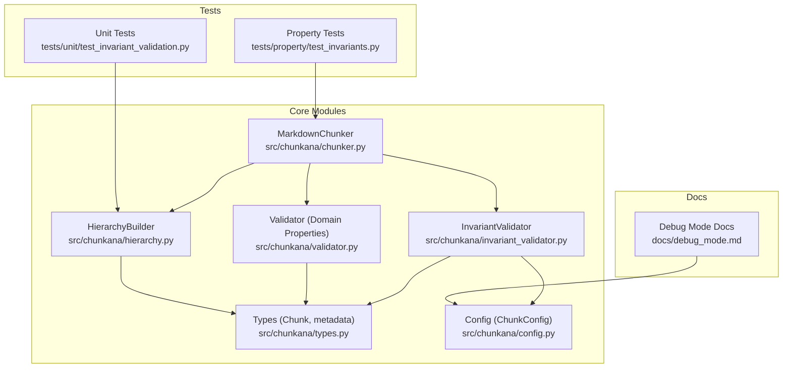
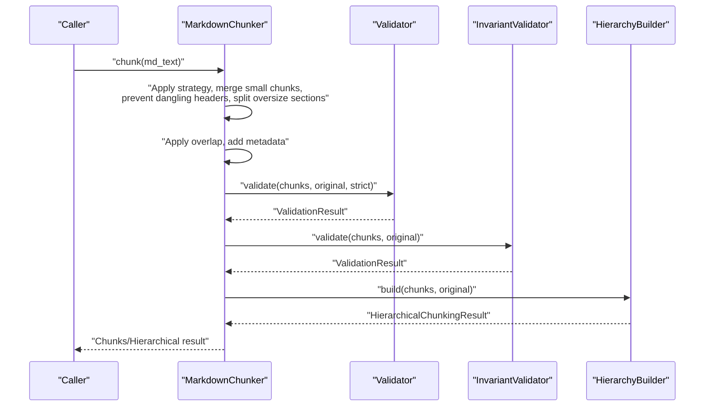
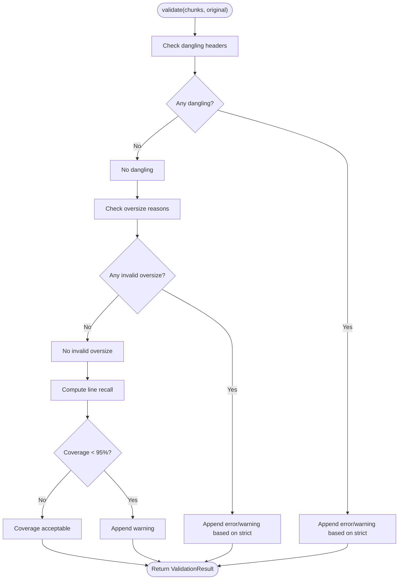
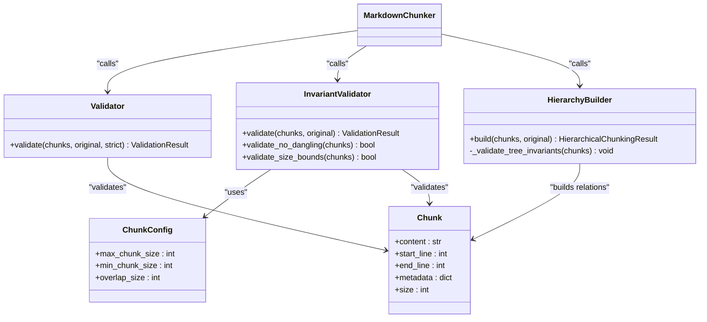

# Invariant Validator

<cite>
**Referenced Files in This Document**
- [invariant_validator.py](file://src/chunkana/invariant_validator.py)
- [validator.py](file://src/chunkana/validator.py)
- [chunker.py](file://src/chunkana/chunker.py)
- [hierarchy.py](file://src/chunkana/hierarchy.py)
- [types.py](file://src/chunkana/types.py)
- [config.py](file://src/chunkana/config.py)
- [exceptions.py](file://src/chunkana/exceptions.py)
- [test_invariant_validation.py](file://tests/unit/test_invariant_validation.py)
- [test_invariants.py](file://tests/property/test_invariants.py)
- [debug_mode.md](file://docs/debug_mode.md)
</cite>

## Table of Contents
1. [Introduction](#introduction)
2. [Project Structure](#project-structure)
3. [Core Components](#core-components)
4. [Architecture Overview](#architecture-overview)
5. [Detailed Component Analysis](#detailed-component-analysis)
6. [Dependency Analysis](#dependency-analysis)
7. [Performance Considerations](#performance-considerations)
8. [Troubleshooting Guide](#troubleshooting-guide)
9. [Conclusion](#conclusion)

## Introduction
This document explains the Invariant Validator subsystem that ensures chunking quality and correctness. It focuses on:
- Detecting dangling headers at chunk boundaries
- Enforcing valid oversize reasons for oversized chunks
- Measuring content coverage using a robust recall metric
- Integrating with the chunking pipeline and hierarchical validation

It also clarifies how this validator complements the domain property checks performed by the main chunker and how it participates in hierarchical tree validation.

## Project Structure
The invariant validation logic is implemented in a dedicated module and integrates with the main chunker and hierarchical builder.

**Diagram sources**
- [invariant_validator.py](file://src/chunkana/invariant_validator.py#L1-L236)
- [validator.py](file://src/chunkana/validator.py#L1-L221)
- [chunker.py](file://src/chunkana/chunker.py#L1-L940)
- [hierarchy.py](file://src/chunkana/hierarchy.py#L1-L966)
- [types.py](file://src/chunkana/types.py#L1-L478)
- [config.py](file://src/chunkana/config.py#L1-L507)
- [test_invariant_validation.py](file://tests/unit/test_invariant_validation.py#L1-L321)
- [test_invariants.py](file://tests/property/test_invariants.py#L1-L741)
- [debug_mode.md](file://docs/debug_mode.md#L82-L100)

**Section sources**
- [invariant_validator.py](file://src/chunkana/invariant_validator.py#L1-L236)
- [validator.py](file://src/chunkana/validator.py#L1-L221)
- [chunker.py](file://src/chunkana/chunker.py#L1-L940)
- [hierarchy.py](file://src/chunkana/hierarchy.py#L1-L966)
- [types.py](file://src/chunkana/types.py#L1-L478)
- [config.py](file://src/chunkana/config.py#L1-L507)
- [test_invariant_validation.py](file://tests/unit/test_invariant_validation.py#L1-L321)
- [test_invariants.py](file://tests/property/test_invariants.py#L1-L741)
- [debug_mode.md](file://docs/debug_mode.md#L82-L100)

## Core Components
- InvariantValidator: Validates dangling headers, oversize reasons, and content coverage.
- Validator (domain properties): Validates PROP-1 through PROP-5 during chunking.
- MarkdownChunker: Orchestrates chunking, overlap, metadata enrichment, and validation.
- HierarchyBuilder: Validates hierarchical tree invariants (is_leaf consistency, parent-child bidirectionality, content range consistency).
- Types and Config: Define Chunk metadata and configuration used by validators.

Key responsibilities:
- InvariantValidator.validate: Runs three checks and returns a detailed ValidationResult.
- Validator.validate: Enforces domain properties (size bounds, monotonic ordering, empty chunks, line numbers).
- HierarchyBuilder._validate_tree_invariants: Enforces tree-level invariants and auto-fixes when not in strict mode.

**Section sources**
- [invariant_validator.py](file://src/chunkana/invariant_validator.py#L1-L236)
- [validator.py](file://src/chunkana/validator.py#L1-L221)
- [chunker.py](file://src/chunkana/chunker.py#L440-L487)
- [hierarchy.py](file://src/chunkana/hierarchy.py#L812-L966)
- [types.py](file://src/chunkana/types.py#L240-L375)
- [config.py](file://src/chunkana/config.py#L17-L126)

## Architecture Overview
The invariant validator participates in two stages:
1. Domain property validation during chunking (Validator).
2. Hierarchical tree validation after building relationships (HierarchyBuilder).
3. Optional content coverage validation (InvariantValidator) for downstream quality checks.

**Diagram sources**
- [chunker.py](file://src/chunkana/chunker.py#L110-L186)
- [validator.py](file://src/chunkana/validator.py#L47-L91)
- [invariant_validator.py](file://src/chunkana/invariant_validator.py#L67-L112)
- [hierarchy.py](file://src/chunkana/hierarchy.py#L260-L308)

## Detailed Component Analysis

### InvariantValidator
Responsibilities:
- Detect dangling headers at chunk boundaries (levels 1–6).
- Validate oversize reasons for chunks exceeding max_chunk_size.
- Compute content coverage using a recall metric based on significant lines.

Processing logic:
- Dangling header detection scans each chunk’s trailing content and flags indices where the last non-empty line is a header.
- Oversize validation checks metadata for allow_oversize and oversize_reason; only specific reasons are accepted.
- Coverage recall counts how many significant lines from the original appear in the concatenated chunks, normalized whitespace to avoid inflation.

**Diagram sources**
- [invariant_validator.py](file://src/chunkana/invariant_validator.py#L67-L112)
- [invariant_validator.py](file://src/chunkana/invariant_validator.py#L114-L167)
- [invariant_validator.py](file://src/chunkana/invariant_validator.py#L168-L212)

**Section sources**
- [invariant_validator.py](file://src/chunkana/invariant_validator.py#L1-L236)
- [types.py](file://src/chunkana/types.py#L240-L375)
- [config.py](file://src/chunkana/config.py#L17-L126)

### Validator (Domain Properties)
Responsibilities:
- PROP-1: No content loss (relaxed check).
- PROP-2: Size bounds enforcement; sets allow_oversize and oversize_reason for oversized chunks.
- PROP-3: Monotonic ordering; sorts chunks if needed.
- PROP-4: No empty chunks enforced by Chunk.__post_init__.
- PROP-5: Valid line numbers enforced by Chunk.__post_init__.

Integration:
- Called by MarkdownChunker._validate after overlap and metadata enrichment.

**Section sources**
- [validator.py](file://src/chunkana/validator.py#L1-L221)
- [chunker.py](file://src/chunkana/chunker.py#L440-L487)
- [types.py](file://src/chunkana/types.py#L292-L307)

### HierarchyBuilder (Tree Invariants)
Responsibilities:
- Build parent-child and sibling relationships from header_path metadata.
- Validate three tree invariants:
  - is_leaf consistency: is_leaf equals (children_ids is empty).
  - Parent-child bidirectionality: mutual parent/child references.
  - Content range consistency: root chunk spans the expected line range.
- Auto-fix inconsistencies when strict_mode is False; raise on first error when strict_mode is True.

Integration:
- Called by MarkdownChunker.chunk_hierarchical after flat chunking.

**Section sources**
- [hierarchy.py](file://src/chunkana/hierarchy.py#L233-L308)
- [hierarchy.py](file://src/chunkana/hierarchy.py#L812-L966)
- [exceptions.py](file://src/chunkana/exceptions.py#L34-L101)

### MarkdownChunker Integration
- Orchestrates the pipeline and invokes both Validator and InvariantValidator.
- Sets oversize metadata defaults for oversized chunks.
- Prevents dangling headers before section splitting.
- Applies overlap and recalculates metadata.

**Section sources**
- [chunker.py](file://src/chunkana/chunker.py#L110-L186)
- [chunker.py](file://src/chunkana/chunker.py#L310-L379)
- [chunker.py](file://src/chunkana/chunker.py#L440-L487)

## Dependency Analysis
- InvariantValidator depends on ChunkConfig and Chunk types.
- Validator depends on Chunk types and ChunkConfig indirectly via Chunk metadata.
- HierarchyBuilder depends on Chunk types and raises HierarchicalInvariantError.
- MarkdownChunker composes Validator, InvariantValidator, and HierarchyBuilder.

**Diagram sources**
- [invariant_validator.py](file://src/chunkana/invariant_validator.py#L1-L236)
- [validator.py](file://src/chunkana/validator.py#L1-L221)
- [hierarchy.py](file://src/chunkana/hierarchy.py#L233-L308)
- [types.py](file://src/chunkana/types.py#L240-L375)
- [config.py](file://src/chunkana/config.py#L17-L126)
- [chunker.py](file://src/chunkana/chunker.py#L1-L940)

**Section sources**
- [invariant_validator.py](file://src/chunkana/invariant_validator.py#L1-L236)
- [validator.py](file://src/chunkana/validator.py#L1-L221)
- [hierarchy.py](file://src/chunkana/hierarchy.py#L233-L308)
- [types.py](file://src/chunkana/types.py#L240-L375)
- [config.py](file://src/chunkana/config.py#L17-L126)
- [chunker.py](file://src/chunkana/chunker.py#L1-L940)

## Performance Considerations
- InvariantValidator runs in linear time relative to the number of chunks and total content length for coverage computation.
- Oversize checks are O(n) over chunks.
- Dangling header detection scans trailing content per chunk; worst-case scanning is proportional to chunk content length.
- HierarchyBuilder validation is O(n) with dictionary lookups for parent/child consistency checks.

Recommendations:
- Keep max_chunk_size reasonable to minimize oversize checks.
- Use overlap_cap_ratio to bound overlap metadata size and reduce coverage computation overhead.
- Avoid extremely large documents without overlap to keep coverage checks efficient.

[No sources needed since this section provides general guidance]

## Troubleshooting Guide
Common issues and resolutions:
- Oversized chunks without valid reason:
  - Cause: Chunk exceeds max_chunk_size without allow_oversize or invalid oversize_reason.
  - Resolution: Ensure allow_oversize is set with a valid reason (code_block_integrity, table_integrity, list_item_integrity).
- Dangling headers at chunk boundaries:
  - Cause: Last non-empty line of a chunk is a header.
  - Resolution: Merge or adjust chunk boundaries to attach headers to content.
- Low content coverage (< 95%):
  - Cause: Significant lines missing from chunks.
  - Resolution: Adjust chunking strategy or increase chunk sizes to retain more content.
- Hierarchical invariant violations:
  - is_leaf_consistency: Ensure is_leaf matches children_ids emptiness.
  - Parent-child bidirectionality: Ensure parent references children_ids and children reference parent_id.
  - Content range consistency: Root chunk should span the full document range.

Operational tips:
- Enable validate_invariants and strict_mode in ChunkConfig to enforce tree invariants strictly.
- Use non-strict mode to auto-fix minor inconsistencies during hierarchical build.

**Section sources**
- [validator.py](file://src/chunkana/validator.py#L115-L142)
- [invariant_validator.py](file://src/chunkana/invariant_validator.py#L145-L167)
- [invariant_validator.py](file://src/chunkana/invariant_validator.py#L168-L212)
- [hierarchy.py](file://src/chunkana/hierarchy.py#L812-L966)
- [exceptions.py](file://src/chunkana/exceptions.py#L34-L101)
- [debug_mode.md](file://docs/debug_mode.md#L82-L100)

## Conclusion
The Invariant Validator provides essential quality checks for chunking correctness:
- Ensures headers are not left dangling at chunk boundaries.
- Enforces valid oversize reasons for oversized chunks.
- Measures content coverage using a fair recall metric.
Combined with domain property validation and hierarchical tree validation, it guarantees reliable chunking results and consistent tree structures.

[No sources needed since this section summarizes without analyzing specific files]